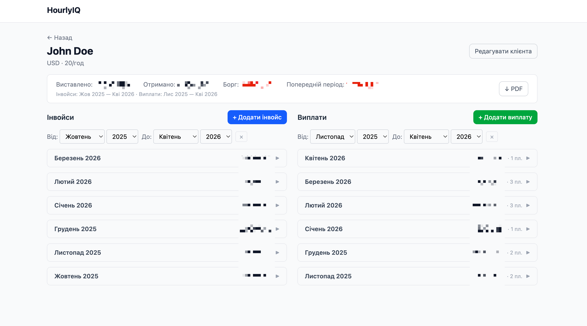

# HourlyIQ

Self-hosted billing tracker for freelance developers.




## Why

Most billing tools tie payments to specific invoices. In practice, clients
pay in parts, late, and without referencing a specific invoice.

HourlyIQ tracks debt at the **client level**: total invoiced minus total
received — no forced invoice-to-payment mapping. You record what you sent,
you record what you got, the app shows you what's missing.

## Features

- Client list with real-time debt overview
- Invoices and payments tracked independently per client
- Split view: invoices on the left, payments on the right
- Group payments by month with collapsible detail
- Date range filters per column (invoice period ≠ payment period)
- PDF export with client summary and both columns
- Single-user, no authentication required
- Fully self-hosted — your data stays local

## Quick Start

**With Docker:**
```bash
git clone https://github.com/evo9/hourly-iq.git
cd hourlyiq
cp .env.example .env
docker-compose up
```
Open http://localhost:3000

**Without Docker:**
```bash
npm install
npm run build:frontend
npm run build
npm start
```

**Development:**
```bash
npm install && npm run start:dev
cd frontend && npm install && npm run dev
```

## Tech Stack

| Layer    | Technology                        |
|----------|-----------------------------------|
| Backend  | NestJS 10, TypeScript             |
| Database | SQLite (better-sqlite3 + TypeORM) |
| Frontend | React 18 + Vite, TypeScript       |
| Styling  | Tailwind CSS                      |
| PDF      | @react-pdf/renderer               |
| Serving  | NestJS ServeStatic (single port)  |

## Notes

**macOS (Apple Silicon / Xcode CLT):** `better-sqlite3` requires native
compilation. If `npm install` fails, try:
```bash
CXXFLAGS="-I$(xcrun --show-sdk-path)/usr/include/c++/v1" npm install
```

## License

MIT
